# System Architecture Analysis

## Overview

- **Project**: /home/tom/github/semcod/taskill
- **Primary Language**: python
- **Languages**: python: 17, yml: 3, shell: 2, yaml: 2, toml: 1
- **Analysis Mode**: static
- **Total Functions**: 60
- **Total Classes**: 20
- **Modules**: 25
- **Entry Points**: 37

## Architecture by Module

### src.taskill.core
- **Functions**: 9
- **Classes**: 2
- **File**: `core.py`

### src.taskill.git_state
- **Functions**: 8
- **Classes**: 2
- **File**: `git_state.py`

### src.taskill.cli
- **Functions**: 7
- **File**: `cli.py`

### src.taskill.providers.algorithmic
- **Functions**: 5
- **Classes**: 1
- **File**: `algorithmic.py`

### src.taskill.providers.base
- **Functions**: 5
- **Classes**: 3
- **File**: `base.py`

### src.taskill.providers.windsurf_mcp
- **Functions**: 4
- **Classes**: 1
- **File**: `windsurf_mcp.py`

### src.taskill.providers.openrouter
- **Functions**: 4
- **Classes**: 1
- **File**: `openrouter.py`

### src.taskill.state
- **Functions**: 3
- **Classes**: 1
- **File**: `state.py`

### src.taskill.updaters.todo
- **Functions**: 3
- **Classes**: 1
- **File**: `todo.py`

### src.taskill.updaters.changelog
- **Functions**: 3
- **Classes**: 1
- **File**: `changelog.py`

### src.taskill.providers
- **Functions**: 2
- **File**: `__init__.py`

### src.taskill.updaters.readme
- **Functions**: 2
- **File**: `readme.py`

### src.taskill.triggers
- **Functions**: 2
- **Classes**: 1
- **File**: `triggers.py`

### src.taskill.updaters.base
- **Functions**: 2
- **Classes**: 2
- **File**: `base.py`

### src.taskill.config
- **Functions**: 1
- **Classes**: 4
- **File**: `config.py`

## Key Entry Points

Main execution flows into the system:

### src.taskill.providers.windsurf_mcp.WindsurfMcpProvider.generate
- **Calls**: src.taskill.providers.windsurf_mcp._candidate_endpoints, self.options.get, OpenRouterProvider._parse_json_loosely, GeneratedDocs, src.taskill.providers.windsurf_mcp._mcp_lib_present, ProviderError, ProviderError, ProviderError

### src.taskill.cli.run
> Execute the update pipeline.
- **Calls**: main.command, click.option, click.option, click.option, src.taskill.config.load_config, Taskill, tk.run, console.print

### src.taskill.providers.openrouter.OpenRouterProvider.generate
- **Calls**: os.getenv, src.taskill.providers.openrouter._normalize_model, self.options.get, self.options.get, self._parse_json_loosely, GeneratedDocs, ProviderError, os.getenv

### src.taskill.cli.status
> Show what taskill would do without running it.
- **Calls**: main.command, click.option, src.taskill.config.load_config, Taskill, tk.status, Table, table.add_column, table.add_column

### src.taskill.providers.algorithmic.AlgorithmicProvider.generate
- **Calls**: defaultdict, self._find_completed_todos, self._extract_new_todos, len, GeneratedDocs, context.get, self._format_commit, entries.append

### src.taskill.core.Taskill.run
- **Calls**: self._snapshot, src.taskill.triggers.evaluate, src.taskill.providers.build_chain, self._build_context, TaskillResult, log.info, TaskillResult, TaskillResult

### src.taskill.updaters.changelog.ChangelogUpdater._update_changelog
> Append entries under [Unreleased]. Returns True if the file changed.
- **Calls**: path.exists, re.compile, pattern.search, m.group, set, path.write_text, path.read_text, original.startswith

### src.taskill.providers.algorithmic.AlgorithmicProvider._find_completed_todos
> Return TODO lines that look completed.

Two signals:
1. Line starts with `- [x]` or `* [x]`  → explicitly checked off.
2. Line content has high token 
- **Calls**: todo_text.splitlines, raw_line.rstrip, re.match, re.match, None.lower, set, line.strip, completed.append

### src.taskill.cli.init
> Generate a starter taskill.yaml + .env.example in the current directory.
- **Calls**: main.command, click.option, Path, Path, yml.write_text, console.print, console.print, console.print

### src.taskill.core.Taskill._apply
- **Calls**: update_changelog, update_todo, src.taskill.updaters.readme.update_readme, changed.append, changed.append, changed.append, str, str

### src.taskill.providers.algorithmic.AlgorithmicProvider._extract_new_todos
- **Calls**: re.compile, set, pat.finditer, None.rstrip, seen.add, new.append, text.lower, text.lower

### src.taskill.core.Taskill._build_context
- **Calls**: self.config.reuse.get, _read, _read, _read, self._maybe_pyqual_report, self.config.files.get, p.exists, p.read_text

### src.taskill.cli.release
> Promote [Unreleased] section to a versioned [VERSION] heading.
- **Calls**: main.command, click.argument, click.option, Path, src.taskill.updaters.changelog.release_unreleased, console.print, console.print, sys.exit

### src.taskill.providers.openrouter.OpenRouterProvider._parse_json_loosely
> Be forgiving: strip ```json fences, extract first {...} block.
- **Calls**: text.strip, re.sub, re.search, json.loads, json.loads, m.group

### src.taskill.cli.main
> taskill — keep README/CHANGELOG/TODO honest.
- **Calls**: click.group, click.version_option, click.option, click.option, src.taskill.cli._setup_logging, ctx.ensure_object

### src.taskill.cli.clean_todo
> Reset TODO.md to an empty header. Use after a release.
- **Calls**: main.command, click.option, click.confirmation_option, src.taskill.updaters.todo.empty_todo, console.print, Path

### src.taskill.updaters.todo.TodoUpdater.apply
> Apply todo updates from generated docs.
- **Calls**: docs.get, docs.get, self.options.get, self._update_todo, UpdateResult

### src.taskill.providers.windsurf_mcp.WindsurfMcpProvider.is_available
- **Calls**: bool, src.taskill.providers.windsurf_mcp._mcp_lib_present, src.taskill.providers.windsurf_mcp._candidate_endpoints

### src.taskill.core.TaskillResult.as_dict
- **Calls**: len, len, len

### src.taskill.core.Taskill.status
> Inspect current trigger state without running anything.
- **Calls**: self._snapshot, src.taskill.triggers.evaluate, len

### src.taskill.core.Taskill._maybe_pyqual_report
> Run `pyqual report --json` if pyqual is on PATH. Tolerate failure.
- **Calls**: subprocess.run, res.stdout.strip, json.loads

### src.taskill.core.Taskill._update_state
- **Calls**: self.state.stamp, p.exists, p.stat

### src.taskill.updaters.changelog.ChangelogUpdater.apply
> Apply changelog updates from generated docs.
- **Calls**: docs.get, self._update_changelog, UpdateResult

### src.taskill.providers.openrouter.OpenRouterProvider.is_available
- **Calls**: bool, os.getenv

### src.taskill.state.TaskillState.stamp
- **Calls**: None.isoformat, datetime.now

### src.taskill.core.Taskill.__init__
- **Calls**: src.taskill.state.load_state, src.taskill.config.load_config

### src.taskill.providers.algorithmic.AlgorithmicProvider._format_commit
- **Calls**: re.sub

### src.taskill.core.Taskill._snapshot
- **Calls**: src.taskill.git_state.collect_snapshot

### src.taskill.triggers.TriggerEvaluation.summary
- **Calls**: None.join

### src.taskill.providers.algorithmic.AlgorithmicProvider.is_available

## Process Flows

Key execution flows identified:

### Flow 1: generate
```
generate [src.taskill.providers.windsurf_mcp.WindsurfMcpProvider]
  └─ →> _candidate_endpoints
  └─ →> _mcp_lib_present
```

### Flow 2: run
```
run [src.taskill.cli]
  └─ →> load_config
```

### Flow 3: status
```
status [src.taskill.cli]
  └─ →> load_config
```

### Flow 4: _update_changelog
```
_update_changelog [src.taskill.updaters.changelog.ChangelogUpdater]
```

### Flow 5: _find_completed_todos
```
_find_completed_todos [src.taskill.providers.algorithmic.AlgorithmicProvider]
```

### Flow 6: init
```
init [src.taskill.cli]
```

### Flow 7: _apply
```
_apply [src.taskill.core.Taskill]
  └─ →> update_readme
      └─> render_status_block
```

### Flow 8: _extract_new_todos
```
_extract_new_todos [src.taskill.providers.algorithmic.AlgorithmicProvider]
```

### Flow 9: _build_context
```
_build_context [src.taskill.core.Taskill]
```

### Flow 10: release
```
release [src.taskill.cli]
  └─ →> release_unreleased
```

## Key Classes

### src.taskill.core.Taskill
- **Methods**: 8
- **Key Methods**: src.taskill.core.Taskill.__init__, src.taskill.core.Taskill.run, src.taskill.core.Taskill.status, src.taskill.core.Taskill._snapshot, src.taskill.core.Taskill._build_context, src.taskill.core.Taskill._maybe_pyqual_report, src.taskill.core.Taskill._apply, src.taskill.core.Taskill._update_state

### src.taskill.providers.algorithmic.AlgorithmicProvider
- **Methods**: 5
- **Key Methods**: src.taskill.providers.algorithmic.AlgorithmicProvider.is_available, src.taskill.providers.algorithmic.AlgorithmicProvider.generate, src.taskill.providers.algorithmic.AlgorithmicProvider._format_commit, src.taskill.providers.algorithmic.AlgorithmicProvider._find_completed_todos, src.taskill.providers.algorithmic.AlgorithmicProvider._extract_new_todos
- **Inherits**: Provider

### src.taskill.providers.openrouter.OpenRouterProvider
- **Methods**: 3
- **Key Methods**: src.taskill.providers.openrouter.OpenRouterProvider.is_available, src.taskill.providers.openrouter.OpenRouterProvider.generate, src.taskill.providers.openrouter.OpenRouterProvider._parse_json_loosely
- **Inherits**: Provider

### src.taskill.providers.base.Provider
> Abstract provider — produces docs from a project snapshot.
- **Methods**: 3
- **Key Methods**: src.taskill.providers.base.Provider.__init__, src.taskill.providers.base.Provider.is_available, src.taskill.providers.base.Provider.generate
- **Inherits**: ABC

### src.taskill.providers.windsurf_mcp.WindsurfMcpProvider
- **Methods**: 2
- **Key Methods**: src.taskill.providers.windsurf_mcp.WindsurfMcpProvider.is_available, src.taskill.providers.windsurf_mcp.WindsurfMcpProvider.generate
- **Inherits**: Provider

### src.taskill.git_state.Commit
- **Methods**: 2
- **Key Methods**: src.taskill.git_state.Commit.conventional_type, src.taskill.git_state.Commit.is_breaking

### src.taskill.state.TaskillState
- **Methods**: 2
- **Key Methods**: src.taskill.state.TaskillState.last_run_dt, src.taskill.state.TaskillState.stamp

### src.taskill.config.TaskillConfig
- **Methods**: 2
- **Key Methods**: src.taskill.config.TaskillConfig.env_model, src.taskill.config.TaskillConfig.env_api_key

### src.taskill.updaters.base.DocumentUpdater
> Abstract updater — applies changes to a document file.
- **Methods**: 2
- **Key Methods**: src.taskill.updaters.base.DocumentUpdater.__init__, src.taskill.updaters.base.DocumentUpdater.apply
- **Inherits**: ABC

### src.taskill.updaters.todo.TodoUpdater
> Updater for TODO.md files.
- **Methods**: 2
- **Key Methods**: src.taskill.updaters.todo.TodoUpdater.apply, src.taskill.updaters.todo.TodoUpdater._update_todo
- **Inherits**: DocumentUpdater

### src.taskill.updaters.changelog.ChangelogUpdater
> Updater for CHANGELOG.md files.
- **Methods**: 2
- **Key Methods**: src.taskill.updaters.changelog.ChangelogUpdater.apply, src.taskill.updaters.changelog.ChangelogUpdater._update_changelog
- **Inherits**: DocumentUpdater

### src.taskill.providers.base.GeneratedDocs
> What every provider returns.
- **Methods**: 1
- **Key Methods**: src.taskill.providers.base.GeneratedDocs.__post_init__

### src.taskill.core.TaskillResult
- **Methods**: 1
- **Key Methods**: src.taskill.core.TaskillResult.as_dict

### src.taskill.triggers.TriggerEvaluation
- **Methods**: 1
- **Key Methods**: src.taskill.triggers.TriggerEvaluation.summary

### src.taskill.git_state.ProjectSnapshot
- **Methods**: 0

### src.taskill.providers.base.ProviderError
> Provider failed — chain falls through to next provider.
- **Methods**: 0
- **Inherits**: Exception

### src.taskill.config.Triggers
> Conditions that must be met to run an update.

All thresholds are OR-ed by default (any one true → r
- **Methods**: 0

### src.taskill.config.ProviderConfig
> Single provider configuration.
- **Methods**: 0

### src.taskill.config.IntegrationConfig
> Optional CI / VCS / orchestrator integration.
- **Methods**: 0

### src.taskill.updaters.base.UpdateResult
> What every updater returns.
- **Methods**: 0

## Data Transformation Functions

Key functions that process and transform data:

### src.taskill.providers.openrouter.OpenRouterProvider._parse_json_loosely
> Be forgiving: strip ```json fences, extract first {...} block.
- **Output to**: text.strip, re.sub, re.search, json.loads, json.loads

### src.taskill.providers.algorithmic.AlgorithmicProvider._format_commit
- **Output to**: re.sub

## Behavioral Patterns

### state_machine_Commit
- **Type**: state_machine
- **Confidence**: 0.70
- **Functions**: src.taskill.git_state.Commit.conventional_type, src.taskill.git_state.Commit.is_breaking

### state_machine_TaskillState
- **Type**: state_machine
- **Confidence**: 0.70
- **Functions**: src.taskill.state.TaskillState.last_run_dt, src.taskill.state.TaskillState.stamp

## Public API Surface

Functions exposed as public API (no underscore prefix):

- `src.taskill.config.load_config` - 35 calls
- `src.taskill.providers.windsurf_mcp.WindsurfMcpProvider.generate` - 32 calls
- `src.taskill.cli.run` - 32 calls
- `src.taskill.providers.openrouter.OpenRouterProvider.generate` - 27 calls
- `src.taskill.cli.status` - 25 calls
- `src.taskill.triggers.evaluate` - 23 calls
- `src.taskill.providers.algorithmic.AlgorithmicProvider.generate` - 21 calls
- `src.taskill.core.Taskill.run` - 20 calls
- `src.taskill.git_state.collect_snapshot` - 13 calls
- `src.taskill.cli.init` - 13 calls
- `src.taskill.git_state.read_coverage` - 11 calls
- `src.taskill.updaters.readme.update_readme` - 11 calls
- `src.taskill.git_state.commits_since` - 8 calls
- `src.taskill.git_state.read_failed_tests` - 8 calls
- `src.taskill.cli.release` - 8 calls
- `src.taskill.providers.discover_providers` - 7 calls
- `src.taskill.state.load_state` - 6 calls
- `src.taskill.cli.main` - 6 calls
- `src.taskill.cli.clean_todo` - 6 calls
- `src.taskill.updaters.changelog.release_unreleased` - 6 calls
- `src.taskill.updaters.readme.render_status_block` - 5 calls
- `src.taskill.providers.base.build_user_prompt` - 5 calls
- `src.taskill.updaters.todo.TodoUpdater.apply` - 5 calls
- `src.taskill.providers.build_chain` - 4 calls
- `src.taskill.git_state.file_hash` - 4 calls
- `src.taskill.state.save_state` - 4 calls
- `src.taskill.providers.windsurf_mcp.WindsurfMcpProvider.is_available` - 3 calls
- `src.taskill.core.TaskillResult.as_dict` - 3 calls
- `src.taskill.core.Taskill.status` - 3 calls
- `src.taskill.updaters.changelog.ChangelogUpdater.apply` - 3 calls
- `src.taskill.providers.openrouter.OpenRouterProvider.is_available` - 2 calls
- `src.taskill.git_state.changed_files_since` - 2 calls
- `src.taskill.state.TaskillState.stamp` - 2 calls
- `src.taskill.git_state.head_sha` - 1 calls
- `src.taskill.triggers.TriggerEvaluation.summary` - 1 calls
- `src.taskill.updaters.todo.empty_todo` - 1 calls
- `src.taskill.providers.algorithmic.AlgorithmicProvider.is_available` - 0 calls
- `src.taskill.providers.base.Provider.is_available` - 0 calls
- `src.taskill.providers.base.Provider.generate` - 0 calls
- `src.taskill.updaters.base.DocumentUpdater.apply` - 0 calls

## System Interactions

How components interact:

```mermaid
graph TD
    generate --> _candidate_endpoints
    generate --> get
    generate --> _parse_json_loosely
    generate --> GeneratedDocs
    generate --> _mcp_lib_present
    run --> command
    run --> option
    run --> load_config
    generate --> getenv
    generate --> _normalize_model
    status --> command
    status --> option
    status --> load_config
    status --> Taskill
    status --> status
    generate --> defaultdict
    generate --> _find_completed_todo
    generate --> _extract_new_todos
    generate --> len
    run --> _snapshot
    run --> evaluate
    run --> build_chain
    run --> _build_context
    run --> TaskillResult
    _update_changelog --> exists
    _update_changelog --> compile
    _update_changelog --> search
    _update_changelog --> group
    _update_changelog --> set
    _find_completed_todo --> splitlines
```



## Reverse Engineering Guidelines

1. **Entry Points**: Start analysis from the entry points listed above
2. **Core Logic**: Focus on classes with many methods
3. **Data Flow**: Follow data transformation functions
4. **Process Flows**: Use the flow diagrams for execution paths
5. **API Surface**: Public API functions reveal the interface

## Context for LLM

Maintain the identified architectural patterns and public API surface when suggesting changes.